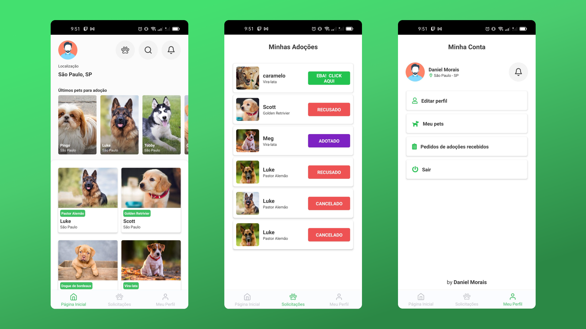

# MeAdote
> Projeto em desenvolvimento...

Projeto criado com o intuito de testar as minhas habilidades com nodeJs e React Native. Foi utilizado o DDD como metodologia de desenvolviento.

## Imagens



## Tecnologias Utilizadas 
- NodeJs (Express)
- React Native
- PostgreSQL
- TypeORM
- Typescript

## Como Usar
> Projeto nunca testado em IOS, pois só uso linux no momento 😅

Iniciar BackEnd
- Crie um Docker do Postgresql
- Execute o comando abaixo
```sh
cd backend && npm install && npm run typeorm migration:run && npm run dev:server
```

Iniciar no mobile
- Execute o comando abaixo
```sh
cd mobile && yarn install && yarn android
```
